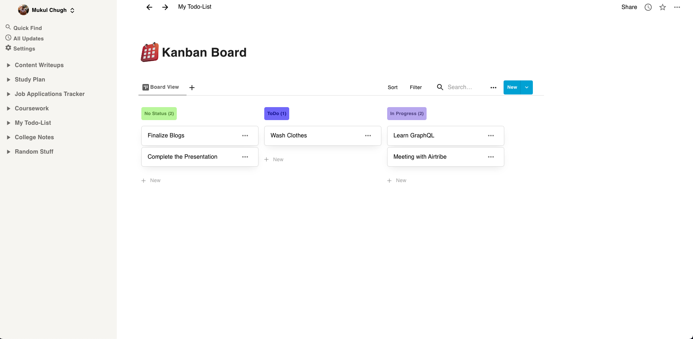
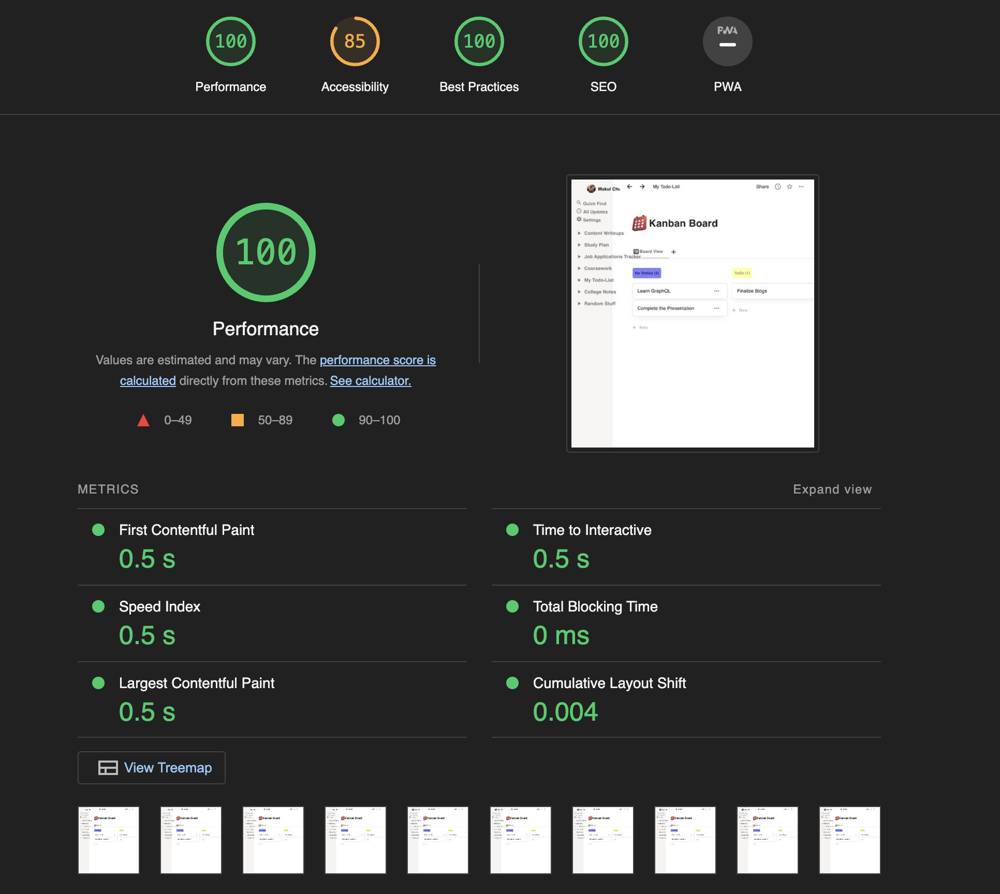

<h1 align="center">KanBoard - A Notion Like KanBan App</h1>
 

 

## Overview

An application created using **ReactJS** and **MUI**.

The application is a Notion inspired kanban board, which lets the user set tasks, and manage routine or projects using the kanban approach. Its User Interface is inspired from Notion (a popular productivity app). KanBoard supports features all CRUD operations i.e. Add, Remove, Update tasks.

This project utilizes React-Beautiful-Dnd package for the implementation of Drag & Drop functionality in the kanban Board. This library if built by Atlassian for implementing the same feature in their products like Jira and Trello.

Currently, the application utilize local storage to save states, and element position.

Future Scope, this can be made a full fledged productivity application, with a dedicated backend and more features like note taking and WYSIWYG Editor etc.

_Note : This application is made as part of internship selection process at AirTribe._

 

## Live URL

The application is hosted on Netlify. Please find the link to it below.

<h3><a href="https://notion-kanboard-mukul.netlify.app/">Demo : See it Live</a></h3>

 

## Tech Stack

- ReactJS  &nbsp; "Javascript Framework"
- MUI  &nbsp; "UI Component Library"
- React-Beautiful-Dnd  &nbsp; "Drag & Drop Feature"

 

## Some major Dependencies

- "@emotion/react": "^11.10.0"
- "@emotion/styled": "^11.10.0"
- "@material-ui/core": "^4.12.4"
- "@material-ui/icons": "^4.11.3"
- "@mui/icons-material": "^5.8.4"
- "@mui/material": "^5.9.3"
- "randomcolor": "^0.6.2"
- "react-beautiful-dnd": "^13.1.0"
- "uuid": "^8.3.2"

 

## Page load time

I used Lighthouse Chrome DevTools to check application performance.

To improve accessibility score, We can optimize the components and implement ARIA based semantics which can improve the accessibility for the app.

**The performance metric varies between 96-100**  
Others remain constant

 

## Run the Project.

In the project directory, you can run:

### `npm start`

Runs the app in the development mode.\
Open [http://localhost:3000](http://localhost:3000) to view it in your browser.

The page will reload when you make changes.\
You may also see any lint errors in the console.

### `npm run build`

Builds the app for production to the `build` folder.\
It correctly bundles React in production mode and optimizes the build for the best performance.

The app is ready to be deployed!
